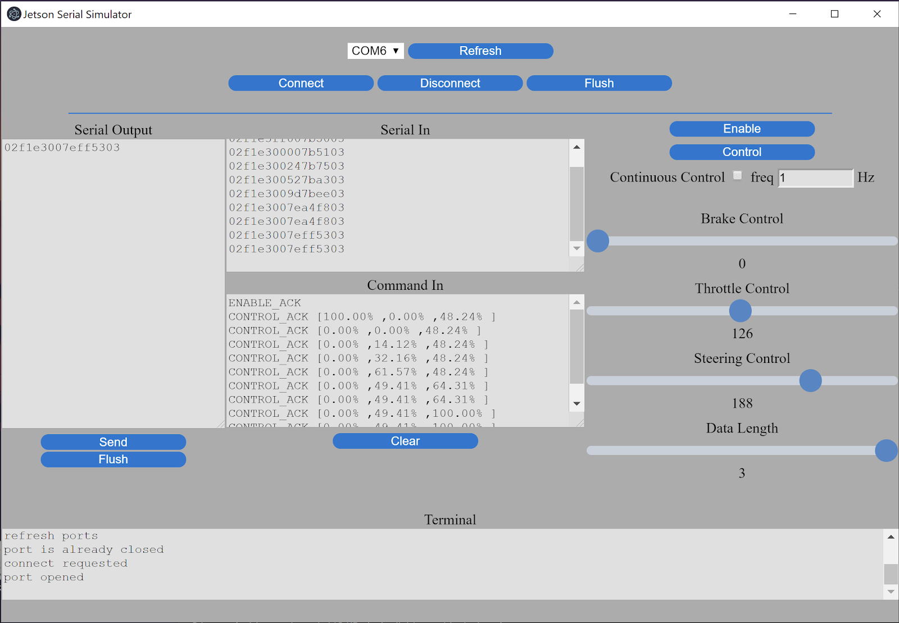

# AMP Jetson Serial Simulator

## Electron based serial simulator for testing serial communication between the Jetson and Arduino MCU

## Video Demonstration

### Description
The simulator uses the Electron Javascript Environment to create a standalone Windows application.  The two main operations for the simulator after connecting to the microcontroller through serial are the Enable and Control modes.  The two buttons in the top right will load the corresponding command into the Serial Output buffer, shown on the left side of the screen.  Once the command is loaded, it can then be sent out to the microcontroller device by pressing the Send button underneath the Serial Output terminal.  

During correct operation, the microcontroller will send back acknowledge packets to confirm that it is receiving.  These acknowledge packets are then parsed into a human readable command to then be displayed in the Command In terminal.  This Command In terminal will show percentages for each of the commanded control values: braking, throttle, and steering.  There is also a continuous control mode that can be toggled with the checkbox in the top right.  This will auto-send the command packets at the frequency desired.  This allows for controlling the kart in real time.  The screenshot below shows an example of the simulator during normal control operation.

